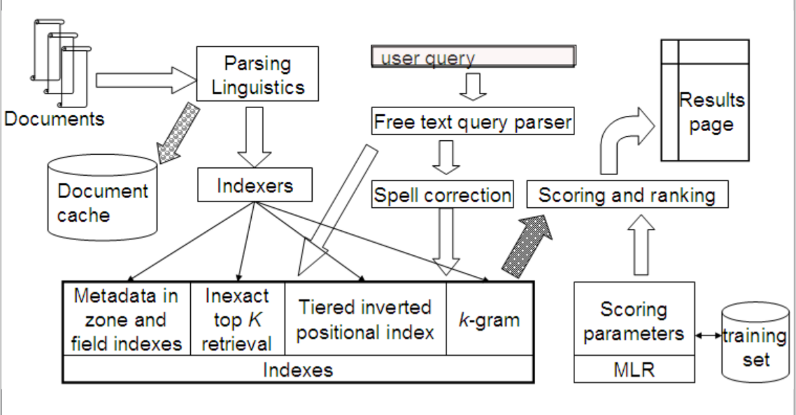

# Information_Retrieval

You probably never ever need to build a search engine from the scratch unless you have information retrieval course :joy:
but cause open source is sacred here is my project, my design and algorithms explanation.

## Black Box 
Let's have high-level view, the service has a bunch of documents, a user types a query and hit enter, our service should
return the docs which are mostly related to the query. The picture below shows a complete search engine which I have implemented
a few components from



## Where to store the documents
First things first, you have a huge number of documents in a real situation, storing them efficiently is a challenge itself.
I suggest using an object storage. Take a look at [https://min.io/](https://min.io/)


## Memory Shortage
This problem is the most important thing I'd like to solve in this project cause if we have as much memory as we like indexing
a document collection will be a piece of cake so in order to simulate the situation for huge document collection I assume
I have only 200 bytes of memory 

### Implementation point
In the previous part I said I wanted to assume I have a 200 byte memory but this assumption will cause a headache in future
cause I can't guess how to read the file in order to both read the file as much as possible and also read the tokens completely,
let's simply use a trick I assume my memory can place 6 words :stuck_out_tongue_winking_eye: .

### BSBI
I want to read documents term by term and keep term id pair in a sorted way but I can't read all the documents at once 
cause I don't have enough memory so I use BSBI algorithm
 
# Make invertible index
####  prepare documents

# the memory is 160 bytes

## Run
1. run minio as object storage 
```sh 
docker compose up -d
```
2. go to [https://127.0.0.1:9000](https://127.0.0.1:9000) and upload your documents
